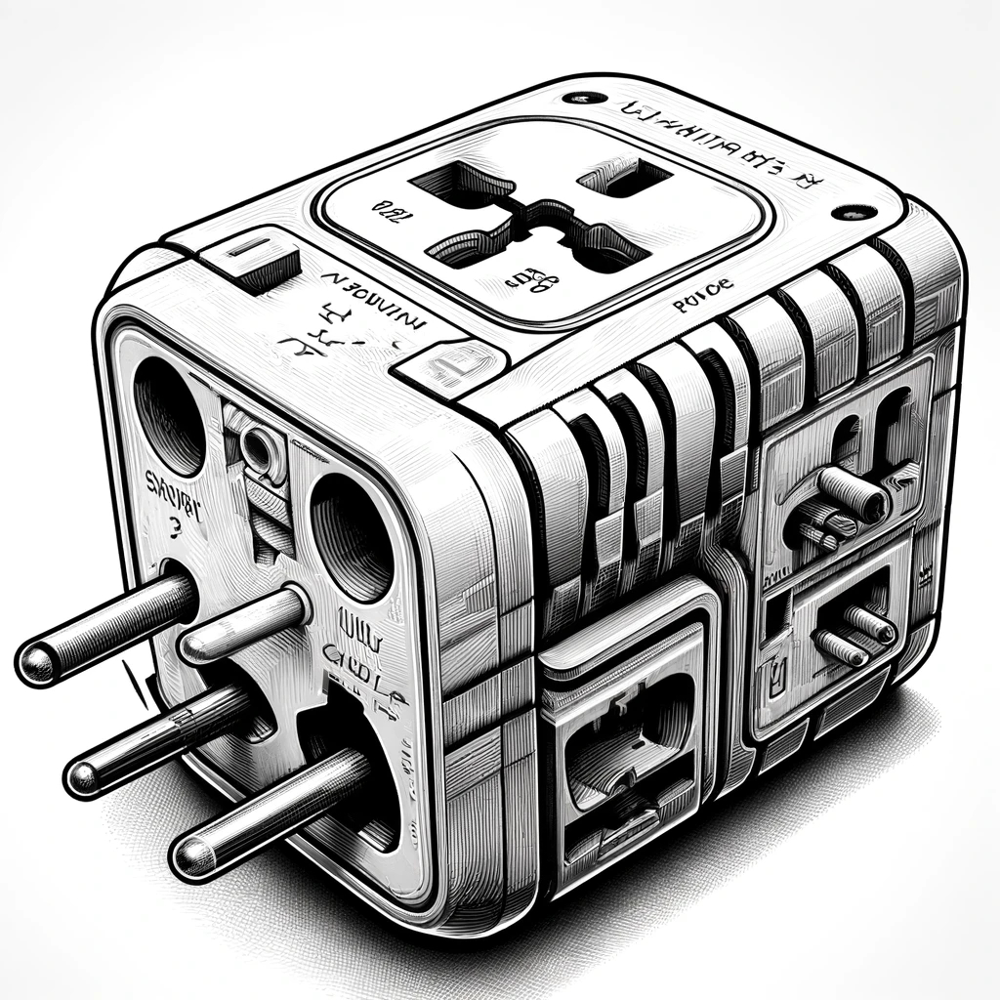

= The Adapter Pattern

== Introduction
Let's say you're traveling around the world and you have various electronic devices like phones, cameras, and laptops. These devices may come with different types of chargers: one might have a European plug, another might have an American plug, and so on.

However, the electrical outlets in different countries might have different shapes and voltages. For instance, some countries have outlets with two flat prongs, while others have outlets with two round prongs or even three prongs in a triangular configuration.

To ensure that your devices can still be charged no matter where you go, you carry a universal adapter with you. This adapter has multiple types of prongs and sockets, allowing it to fit into different types of outlets around the world. So, regardless of whether you're in Europe, Asia, or North America, you can simply plug your devices into the adapter, and the adapter into the local outlet, ensuring that you can stay connected and powered up wherever you are. 

In this scenario, the universal adapter acts as an adapter pattern, bridging the gap between the different types of plugs on your devices and the various types of outlets you encounter during your travels. Just like how the adapter enables your devices to work with different outlets, the adapter pattern enables different classes or objects to work together despite having different interfaces.