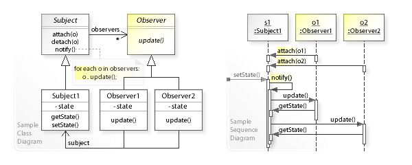

# Chapter: Observer Pattern in Java

## Introduction to Observer Pattern

Imagine you're in a classroom where the teacher is like a news broadcaster, giving out information (or "news") to all the students. Now, in this classroom, some students are interested in math news, some in science news, and others might be interested in literature news. Each student who is interested in a particular type of news tells the teacher, "Hey, please let me know whenever there's news about my favorite subject!"

The Observer Pattern works a lot like this classroom scenario. In this pattern, the teacher acts as the "Subject," and the students are the "Observers." The Subject has important information or updates to share, and the Observers are interested in receiving updates about certain topics.

1. **Subject (Teacher):** This is the main object that has the information or updates. It keeps a list of observers (students) who want to be notified about certain information.

2. **Observers (Students):** These are the objects or people interested in receiving updates from the Subject. They subscribe (or "register interest") to the Subject to get the news they care about.

Whenever the Subject has new information or an update (like the teacher getting news about a science competition), it goes through its list of Observers (students who are interested in science news) and sends them the update (tells them about the competition). This way, only the students who are interested in science news will be notified, and not everyone in the class gets the same information, preventing those who are not interested from being overloaded with irrelevant news.

In summary, the Observer Pattern is a way for objects (Observers) to receive updates or notifications about changes or news from another object (Subject), based on their interests. It's like subscribing to a newsletter but in a programming context.


## Key Components

The Observer Pattern comprises two essential components:

- **Subject (Observable):** The subject represents the object being observed. It maintains a list of observers and provides methods for attaching, detaching, and notifying observers of any changes in its state.
- **Observer:** Observers are entities interested in the state changes of the observable. They adhere to a common interface that includes an update method, allowing them to react appropriately to changes in the observable.

## Diagram


### Class Diagram
#### Observable Class
This class is at the heart of the pattern, acting as the subject that maintains a list of its observers. It typically includes three main operations:

- **registerObserver(Observer)**: Allows an observer to register itself with the observable to receive updates.
- **removeObserver(Observer)**: Permits an observer to remove itself from the list, stopping it from receiving further updates.
- **notifyObservers()**: Invoked to notify all registered observers about a change. This can be done by pushing the new state to the observers or allowing them to pull it.

#### Observer Interface
Defines the `update` method that any class wishing to receive notifications from the observable must implement. The specifics of this method can vary depending on the observable's approach to notifying observers (push vs. pull).

#### Concrete Observer Classes
These are specific implementations of the Observer interface. Each one will implement the `update` method to respond to notifications from the observable in a manner appropriate to its role.

#### Relationships
- A one-to-many relationship exists between the Observable class and the Observer interface, indicating that one observable can have multiple observers attached to it.
- Concrete Observer classes implement the Observer interface, which establishes an inheritance relationship.

## Implementation Walkthrough

Let's delve into the nitty-gritty of implementing the Observer Pattern in Java:

1. **Observable Interface**

```java
import java.util.ArrayList;
import java.util.List;

interface Observable {
    void addObserver(Observer observer);
    void removeObserver(Observer observer);
    void notifyObservers();
}
```
The Observable interface outlines the methods necessary for managing observers and notifying them of changes.
### Methods Defined in the Observable

- `void addObserver(Observer observer);`  
  This method is intended to add an observer to the list of observers for the observable object, meaning it "registers" an observer to receive updates.

- `void removeObserver(Observer observer);`  
  Conversely, this method removes an observer from the observable object's list of observers, effectively "unregistering" it from receiving updates.

- `void notifyObservers();`  
  This method is used to notify all registered observers of a change or event by calling one of their methods. It's how the observable object broadcasts updates to interested parties.

2. **Observer Interface**

```java
interface Observer {
    void update();
}
```
The Observer interface defines the update method that observers must implement to respond to changes in the observable.

3. **Concrete Observable Class**

```java
class ConcreteObservable implements Observable {
    private List<Observer> observers = new ArrayList<>();

    @Override
    public void addObserver(Observer observer) {
        observers.add(observer);
    }

    @Override
    public void removeObserver(Observer observer) {
        observers.remove(observer);
    }

    @Override
    public void notifyObservers() {
        for (Observer observer : observers) {
            observer.update();
        }
    }
}
```
The ConcreteObservable class implements the Observable interface and manages the list of observers.

4. **Concrete Observer Class**

```java
class ConcreteObserver implements Observer {
    @Override
    public void update() {
        System.out.println("Observer notified of state change.");
    }
}
```
The ConcreteObserver class implements the Observer interface and specifies the actions to be taken when notified of a state change.

5. **Main Method**

```java
public class ObserverPatternExample {

    public static void main(String[] args) {
        ConcreteObservable observable = new ConcreteObservable();
        ConcreteObserver observer1 = new ConcreteObserver();
        ConcreteObserver observer2 = new ConcreteObserver();

        observable.addObserver(observer1);
        observable.addObserver(observer2);

        observable.notifyObservers();
    }
}
```
In the main method, we instantiate objects of the ConcreteObservable and ConcreteObserver classes.
We register the observer instances with the observable using the addObserver method.
We then notify all observers by calling the notifyObservers method.

## Real-life Example: Report Observer with Walkthrough

Consider a scenario where a `TestReportGenerator` class generates test reports, and we want to notify observers when a report is generated:

```java
class TestReportGenerator implements Observable {
    private List<Observer> observers = new ArrayList<>();

    public void generateReport() {
        // Generate test report
        System.out.println("Generating test report...");

        // Notify observers
        notifyObservers();
    }

    @Override
    public void addObserver(Observer observer) {
        observers.add(observer);
    }

    @Override
    public void removeObserver(Observer observer) {
        observers.remove(observer);
    }

    @Override
    public void notifyObservers() {
        for (Observer observer : observers) {
            observer.update();
        }
    }
}

class ReportObserver implements Observer {
    @Override
    public void update() {
        System.out.println("Report generated. Notifying observers...");
    }
}
```
The TestReportGenerator class generates reports and notifies observers upon report generation.
The ReportObserver class reacts to notifications by printing a message.


```java
public class ReportObserverExample {

    public static void main(String[] args) {
        TestReportGenerator reportGenerator = new TestReportGenerator();
        ReportObserver reportObserver1 = new ReportObserver();
        ReportObserver reportObserver2 = new ReportObserver();

        reportGenerator.addObserver(reportObserver1);
        reportGenerator.addObserver(reportObserver2);

        reportGenerator.generateReport();
    }
}
```
In the main method, we create instances of the TestReportGenerator and ReportObserver classes.
We register observer instances with the report generator using the addObserver method.
We then generate a test report using the generateReport method, which triggers the notification of all observers.

## Design Considerations

When implementing the Observer Pattern, it's crucial to consider several factors:

- **Decoupling:** The Observer Pattern promotes loose coupling between the subject and its observers, leading to better maintainability and flexibility in the codebase.
- **Scalability:** The pattern supports multiple observers subscribing to a single subject, making it scalable and adaptable to changing requirements.
- **Flexibility:** Observers can be added or removed dynamically during runtime, providing flexibility in managing dependencies and behaviors.
- **Responsiveness:** Observers are notified immediately when changes occur in the subject's state, ensuring timely updates and responsiveness in the system.

# Conclusion

The Observer Pattern is a cornerstone of modern software design, enabling flexible and decoupled systems. By facilitating dynamic communication between objects, it enhances maintainability, scalability, and responsiveness. Understanding and applying the Observer Pattern principles is crucial for building robust and adaptable software solutions.
